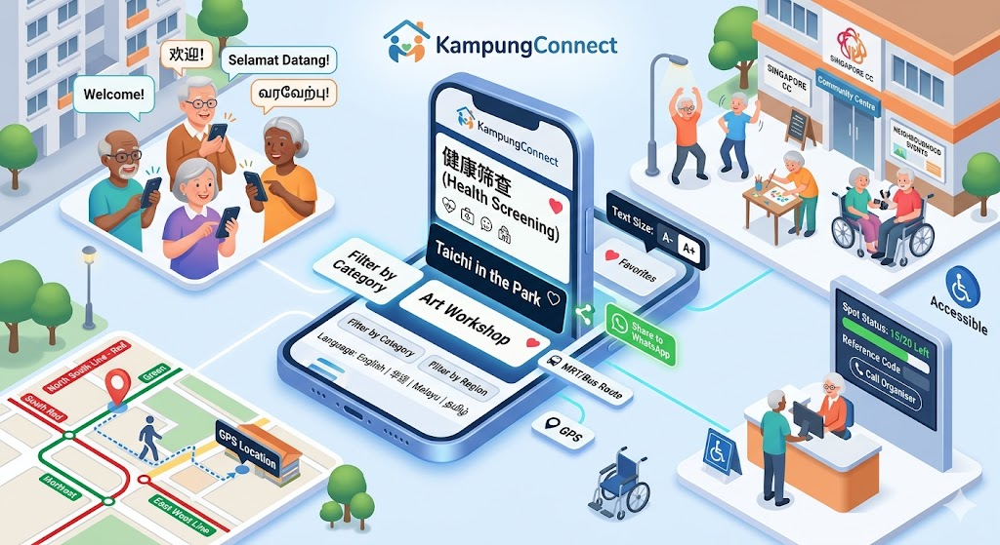

<p align="center">
  
</p>

<h1 align="center">🏘️ KampungConnect</h1>

<p align="center">
  <em>Connecting Singapore's seniors to community events in their neighbourhood.</em>
</p>

<p align="center">
  
  
  
  
</p>

---

## Table of Contents

- [Motivation](#motivation)
- [Features](#features)
- [Architecture](#architecture)
- [Project Structure](#project-structure)
- [Technical Highlights](#technical-highlights)
- [Getting Started](#getting-started)
- [Screenshots](#screenshots)
- [Roadmap](#roadmap)
- [License](#license)

---

## Motivation

Singapore's senior population is growing rapidly — by 2030, 1 in 4 citizens will be aged 65 and above. Many seniors face social isolation, especially those living alone in HDB flats. Community Centres (CCs) and Residents' Committees (RCs) run hundreds of events every month — exercise classes, health screenings, social gatherings, cultural activities — but the information is:

- **Scattered** across multiple websites (onePA, individual CC pages, Facebook groups)
- **Hard to navigate** for seniors who may not be digitally confident
- **Only in English** on most platforms, excluding seniors who are more comfortable in Mandarin, Malay, or Tamil

**KampungConnect** solves this by bringing all community events into one senior-friendly interface — in their language, with transport help to actually get there, and the ability to register and share with family.

> *Kampung* (Malay: village) — the kampung spirit of looking out for one another is at the heart of this app.

---

## Features

| Feature | Description |
|---|---|
| 🌐 **4-Language Support** | Full UI in English, 华语 (Mandarin), Melayu, and தமிழ் (Tamil) — Singapore's four official languages |
| 🔍 **Smart Filtering** | Filter by category (exercise, social, health, learning, arts, food), region (N/S/E/W/Central), price, and keyword search |
| 📝 **Event Registration** | Register with name and phone number; pending approval flow with reference code (e.g. `PA-K7NX3M`) and SMS confirmation messaging |
| 🚇 **Transport Guide** | Simulated GPS location detection → personalised MRT and bus route options with line colours, transfer stations, walking directions |
| 📊 **Registration Progress** | Live progress bar showing spots filled, colour-coded green → orange → red, with "Almost full! 🔥" alerts |
| ♡ **Favourites** | Save events with a heart button; persisted in localStorage across sessions |
| 📤 **Share with Family** | One-tap share via native share sheet (mobile) or clipboard copy with WhatsApp-friendly formatted message |
| 🔤 **Text Size Toggle** | A-/A+ control with 3 levels for seniors with varying eyesight |
| ♿ **Accessibility** | Wheelchair accessibility indicators, ARIA labels, semantic HTML, keyboard navigation, screen reader support |
| 📱 **Mobile-First** | Responsive design optimised for phones (how most seniors browse), with bottom-sheet modals |

---

## Architecture

```
┌─────────────────────────────────────────────────┐
│                   Browser (Client)               │
│                                                   │
│  ┌─────────┐  ┌──────────┐  ┌────────────────┐  │
│  │ Language │  │ Filters  │  │  Text Size     │  │
│  │ Switcher │  │   Bar    │  │  Toggle        │  │
│  └────┬─────┘  └────┬─────┘  └───────┬────────┘  │
│       │              │                │            │
│       ▼              ▼                ▼            │
│  ┌─────────────────────────────────────────────┐  │
│  │              Page State (React)              │  │
│  │  lang | filters | favourites | textSize      │  │
│  └──────────────────┬──────────────────────────┘  │
│                     │                              │
│                     ▼                              │
│  ┌─────────────────────────────────────────────┐  │
│  │            Event Card List                   │  │
│  │  ┌──────────┐ ┌──────────┐ ┌──────────┐    │  │
│  │  │EventCard │ │EventCard │ │EventCard │    │  │
│  │  │ ♡ Share  │ │ ♡ Share  │ │ ♡ Share  │    │  │
│  │  │ Register │ │ Register │ │ Register │    │  │
│  │  │Transport │ │Transport │ │Transport │    │  │
│  │  └──────────┘ └──────────┘ └──────────┘    │  │
│  └─────────────────────────────────────────────┘  │
│                                                   │
│  ┌──────────────┐  ┌───────────────────────────┐  │
│  │ localStorage │  │  Modals (Transport /      │  │
│  │ (favourites) │  │  Register / Share toast)   │  │
│  └──────────────┘  └───────────────────────────┘  │
└─────────────────────────────────────────────────┘

┌─────────────────────────────────────────────────┐
│                  Data Layer                       │
│                                                   │
│  events.ts ──── Simulated event data (16 events) │
│  translations.ts ── i18n strings (4 languages)   │
│  types/index.ts ── TypeScript interfaces          │
└─────────────────────────────────────────────────┘
```

The app is a **fully client-side Next.js application** (static export). No backend or database is required. All state is managed with React hooks and localStorage for persistence.

---

## Project Structure

```
kampung-connect/
├── public/
│   └── images/
│       └── hero.png              # Hero illustration
├── src/
│   ├── app/
│   │   ├── globals.css           # Tailwind + custom utilities
│   │   ├── layout.tsx            # Root layout with metadata
│   │   └── page.tsx              # Main page — hero, filters, event list
│   ├── components/
│   │   ├── EventCard.tsx         # Event card with ♡, share, register, transport
│   │   ├── FilterBar.tsx         # Category, region, price, search filters
│   │   ├── LanguageSwitcher.tsx  # EN / 华语 / Melayu / தமிழ் toggle
│   │   ├── RegisterModal.tsx     # Registration form → pending approval flow
│   │   ├── TextSizeToggle.tsx    # A- / A+ font size control
│   │   └── TransportGuide.tsx    # GPS detection → MRT/bus route options
│   ├── data/
│   │   ├── events.ts            # 16 simulated events with transport data
│   │   └── translations.ts      # All UI strings in 4 languages
│   └── types/
│       └── index.ts             # TypeScript interfaces
├── tailwind.config.ts
├── tsconfig.json
├── next.config.js
├── package.json
└── README.md
```

---

## Technical Highlights

### Internationalisation (i18n)
- Custom lightweight i18n system — no heavy library dependency
- All 4 official Singapore languages supported with full UI coverage
- Event titles and descriptions are multilingual
- Date formatting uses locale-aware `toLocaleDateString()` (e.g. `en-SG`, `zh-SG`)

### Senior-Friendly UX Design
- Base font sizes start at 1.125rem (`senior-sm`) up to 2.75rem (`senior-3xl`)
- 3-level text size toggle that scales the entire page
- High contrast colour choices; colour-coded but never colour-only (always paired with text/icons)
- Large tap targets (min 44px) for touch accessibility
- Bottom-sheet modals on mobile for thumb-friendly interaction

### Simulated Transport Intelligence
- Randomised user location from 8 real Singapore neighbourhoods
- Route generation algorithm that detects same-line vs cross-line MRT journeys
- Automatic transfer station selection based on line intersections
- MRT line colours match the real SMRT/SBS colour scheme (red NSL, green EWL, purple NEL, etc.)
- Bus service numbers are realistic for each CC's actual location

### State Management
- React `useState` + `useMemo` for filters and derived event lists
- `localStorage` for favourite persistence across sessions
- Component-level state for registration and modal visibility
- No external state library needed — keeps bundle small (108KB first load)

### Performance
- Static site generation (SSG) — zero server-side rendering overhead
- Next.js Image component with priority loading for hero
- Staggered CSS animations (no JS animation library)
- Total first-load JS: ~113KB (well under budget for mobile)

---

## Getting Started

### Prerequisites
- Node.js 18+ 
- npm 9+

### Installation

```bash
# Clone the repository
git clone https://github.com/your-username/kampung-connect.git
cd kampung-connect

# Install dependencies
npm install

# Start development server
npm run dev
```

Open [http://localhost:3000](http://localhost:3000) in your browser.

### Build for Production

```bash
npm run build
npm start
```

### Deploy to Vercel

Connect your GitHub repo to [Vercel](https://vercel.com) — it deploys automatically on every push.

---

## Screenshots


## Roadmap

- [ ] **Real data integration** — connect to onePA API when/if PA opens a public endpoint
- [ ] **Map view** — show events on an interactive map (Leaflet / OneMap)
- [ ] **PWA support** — installable on phone homescreen with offline caching
- [ ] **Dark mode / high contrast** — additional accessibility option
- [ ] **Push notifications** — remind seniors of upcoming saved events
- [ ] **Admin panel** — for CC staff to add/edit events directly
- [ ] **Feedback system** — post-event ratings and comments
- [ ] **Caregiver mode** — family members can manage events for multiple seniors

---

## License

This project is licensed under the MIT License. See [LICENSE](LICENSE) for details.

---

<p align="center">
  Made with ❤️ for Singapore's seniors<br/>
  <em>Because everyone deserves to feel connected.</em>
</p>
